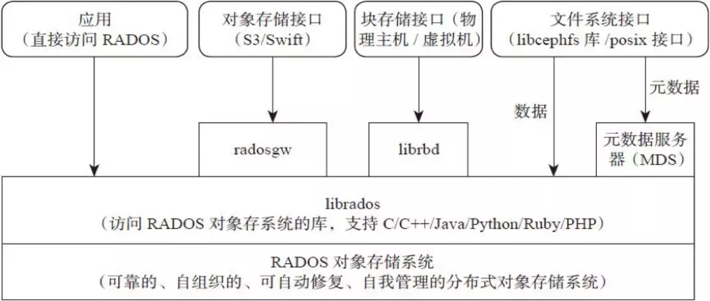
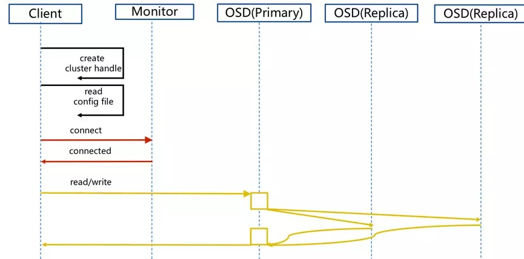

## ceph存储系统

Ceph是一个统一的分布式存储系统，具有高性能、高可用、高可扩展特性丰富的特点。

### Ceph的架构

Ceph支持三种接口：

- Object：有原生的 API，而且也兼容 Swift 和 S3 的 API。
- Block：支持精简配置、快照、克隆。
- File：Posix 接口，支持快照。

### Ceph的IO流程

### Ceph核心组件及概念介绍

- Monitor

一个 Ceph 集群需要多个 Monitor 组成的小集群，它们通过 Paxos 同步数据，用来保存 OSD 的元数据。

- OSD

OSD 全称 Object Storage Device，也就是负责响应客户端请求返回具体数据的进程。一个 Ceph 集群一般都有很多个 OSD。

- MDS

MDS 全称 Ceph Metadata Server，是 CephFS 服务依赖的元数据服务。

- Object

Ceph 最底层的存储单元是 Object 对象，每个 Object 包含元数据和原始数据。 

- PG

PG 全称 Placement Grouops，是一个逻辑的概念，一个 PG 包含多个 OSD。引入 PG 这一层其实是为了更好的分配数据和定位数据。

- RADOS

RADOS 全称 Reliable Autonomic Distributed Object Store，是 Ceph 集群的精华，用户实现数据分配、Failover 等集群操作。

- Libradio

Librados 是 Rados 提供库，因为 RADOS 是协议很难直接访问，因此上层的 RBD、RGW 和 CephFS 都是通过 librados 访问的，目前提供 PHP、Ruby、Java、Python、C和C++支持。

- CRUSH

CRUSH 是 Ceph 使用的数据分布算法，类似一致性哈希，让数据分配到预期的地方。

- RBD

RBD 全称 RADOS block device，是 Ceph 对外提供的块设备服务。

- RGW

RGW 全称 RADOS gateway，是 Ceph 对外提供的对象存储服务，接口与 S3 和 Swift 兼容。

- CephFS

CephFS 全称 Ceph File System，是 Ceph 对外提供的文件系统服务。